# AWS EKS Production Platform


## Overview

A production-style Kubernetes platform built on Amazon EKS using Terraform, Docker, Amazon ECR, GitHub Actions, AWS Load Balancer Controller, and Application Load Balancers (ALB).

This project demonstrates modern DevOps practices including Infrastructure as Code (IaC), containerization, Kubernetes orchestration, CI/CD automation, and cloud-native application deployment on AWS.
## Project Highlights

- Provisioned AWS infrastructure using Terraform
- Built and managed Amazon EKS cluster
- Implemented AWS Load Balancer Controller
- Configured ALB-backed Kubernetes Ingress
- Containerized application using Docker
- Stored images in Amazon ECR
- Implemented GitHub Actions CI/CD pipeline
- Automated deployment to Amazon EKS
- Configured IAM Roles for Service Accounts (IRSA)

---

## Architecture

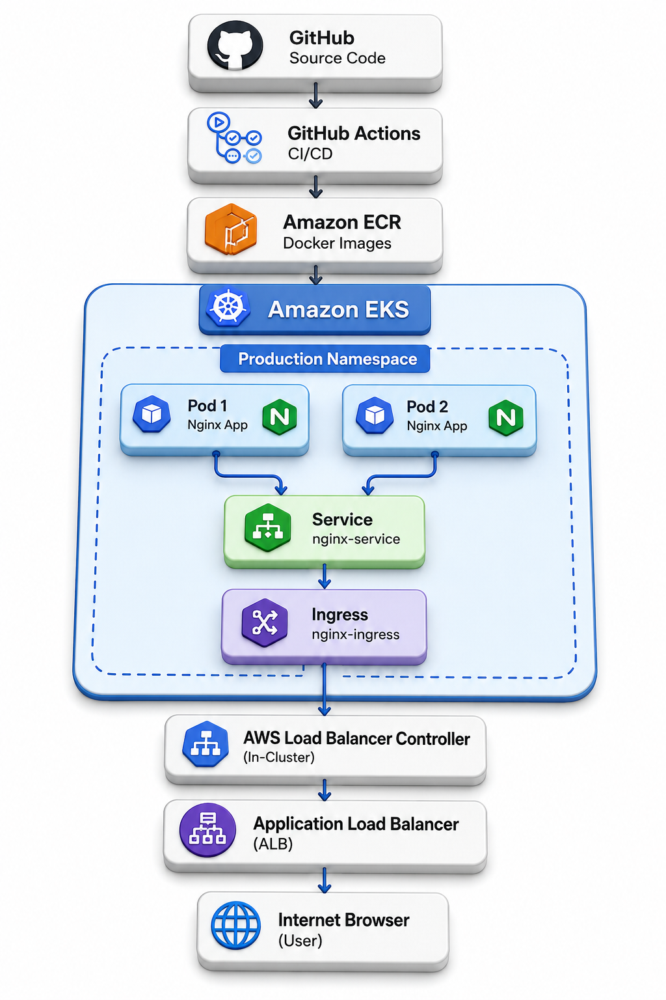


## Skills Demonstrated

### AWS
- Amazon EKS
- Amazon ECR
- IAM
- VPC
- Application Load Balancer (ALB)

### Kubernetes
- Deployments
- Services
- Ingress
- Namespaces
- Managed Node Groups

### DevOps
- Terraform
- Docker
- GitHub Actions
- CI/CD
- Infrastructure as Code (IaC)

### Networking
- Public Subnets
- Private Subnets
- NAT Gateway
- Internet Gateway
- Route Tables

---
### Request Flow

1. Developer pushes code to GitHub
2. GitHub Actions builds Docker image
3. Image is pushed to Amazon ECR
4. GitHub Actions updates Amazon EKS
5. Pods pull image from ECR
6. Ingress routes traffic
7. AWS Load Balancer Controller manages ALB
8. Users access application through ALB
   
---
```text
GitHub
   │
   ▼
GitHub Actions
   │
   ▼
Amazon ECR
   │
   ▼
Amazon EKS
   │
   ▼
AWS Load Balancer Controller
   │
   ▼
Application Load Balancer (ALB)
   │
   ▼
Kubernetes Service
   │
   ▼
Pods
```

---

## Technologies Used

### Cloud

* Amazon Web Services (AWS)
* Amazon EKS
* Amazon ECR
* IAM
* VPC
* Application Load Balancer (ALB)

### Infrastructure as Code

* Terraform

### Containerization

* Docker

### Kubernetes

* Deployments
* Services
* Ingress
* AWS Load Balancer Controller
* IRSA (IAM Roles for Service Accounts)

### CI/CD

* GitHub Actions

---

## Features

### Infrastructure Provisioning

* Custom VPC
* Public Subnets
* Private Subnets
* Internet Gateway
* NAT Gateway
* Route Tables
* IAM Roles and Policies

### Kubernetes Platform

* Amazon EKS Cluster
* Managed Node Groups
* Namespace Management
* Deployments
* Services
* Ingress Resources

### Container Registry

* Amazon ECR Integration
* Automated Image Storage

### Continuous Integration / Continuous Deployment

* GitHub Actions Pipeline
* Automated Docker Build
* Automated ECR Push
* Automated EKS Deployment

---

## Repository Structure

```text
aws-eks-production-platform/
├── .github/
│   └── workflows/
│       └── deploy.yml
├── app/
│   ├── Dockerfile
│   └── index.html
├── kubernetes/
│   ├── deployment.yaml
│   ├── ingress.yaml
│   ├── namespaces.yaml
│   └── service.yaml
├── terraform/
│   ├── eks.tf
│   ├── iam.tf
│   ├── node-groups.tf
│   ├── outputs.tf
│   ├── providers.tf
│   ├── variables.tf
│   ├── versions.tf
│   └── vpc.tf
└── README.md
```

---

## CI/CD Workflow

The deployment pipeline automatically executes whenever code is pushed to the master branch.

### Workflow Steps

1. Checkout source code
2. Configure AWS credentials
3. Authenticate with Amazon ECR
4. Build Docker image
5. Push image to Amazon ECR
6. Update Kubernetes deployment
7. Roll out application to Amazon EKS

---

## Infrastructure Provisioning

### Initialize Terraform

```bash
terraform init
```

### Validate Configuration

```bash
terraform validate
```

### Deploy Infrastructure

```bash
terraform apply
```

### Destroy Infrastructure

```bash
terraform destroy
```

---

## Kubernetes Deployment

### Deploy Application

```bash
kubectl apply -f kubernetes/
```

### Verify Pods

```bash
kubectl get pods -n production
```

### Verify Ingress

```bash
kubectl get ingress -n production
```

---

## Project Achievements

* Built AWS infrastructure using Terraform
* Provisioned Amazon EKS cluster
* Implemented AWS Load Balancer Controller
* Configured ALB-based Ingress
* Containerized application using Docker
* Stored images in Amazon ECR
* Automated deployment using GitHub Actions
* Implemented production-style Kubernetes architecture

---

## Future Enhancements

* Prometheus Monitoring
* Grafana Dashboards
* Loki Logging
* ArgoCD GitOps
* Route53 Integration
* SSL/TLS with ACM
* Helm Chart Packaging
* Blue/Green Deployments
* Canary Releases

---

## Project Screenshots

Terraform Apply Success
kubectl get nodes
GitHub Actions Successful Run
ECR Repository
ALB Ingress Output
Final Application Page
EKS Cluster in AWS Console

## Project Screenshots

### Terraform Infrastructure Outputs

The Terraform deployment successfully provisioned the AWS infrastructure, including the VPC, subnets, IAM roles, NAT Gateway, and EKS cluster.

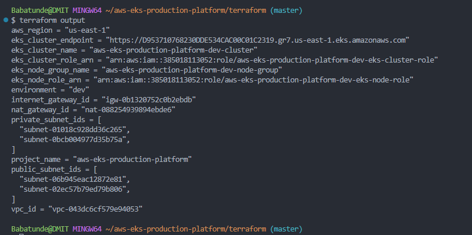

---

### EKS Worker Nodes

Both managed worker nodes successfully joined the EKS cluster and are in the Ready state.

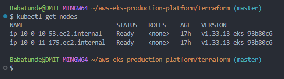

---

### AWS Application Load Balancer (ALB) Ingress

The AWS Load Balancer Controller automatically provisioned an Application Load Balancer and associated it with the Kubernetes Ingress resource.

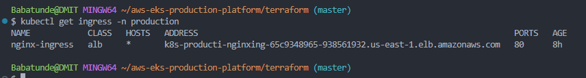

---

### GitHub Actions CI/CD Pipeline

Successful GitHub Actions workflow execution showing automated build and deployment to Amazon EKS.

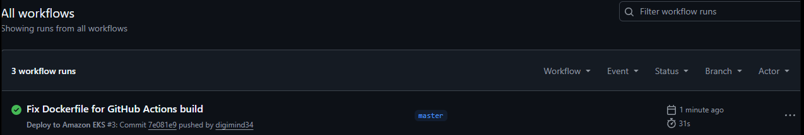

---

### Amazon ECR Repository

Container images are stored and versioned in Amazon Elastic Container Registry (ECR).

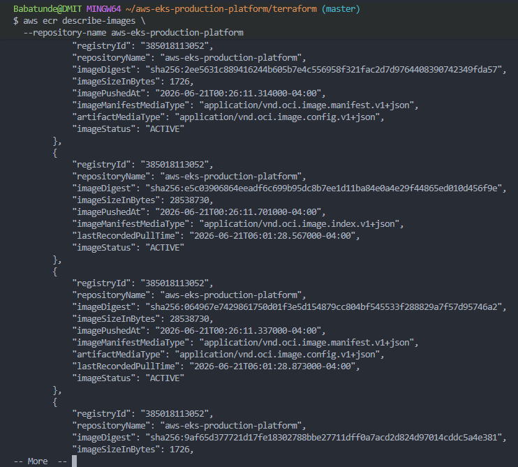

---

### Amazon EKS Cluster

Amazon EKS cluster running in Active state with managed worker nodes.

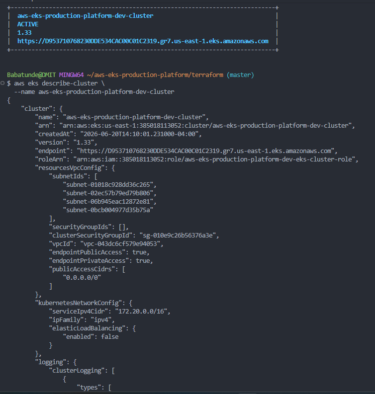

---

### Application Running Through AWS ALB

The application is accessible through the AWS Application Load Balancer provisioned by the AWS Load Balancer Controller.

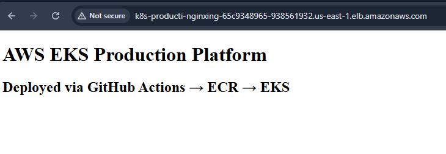

---

## Phase 8A: Monitoring & Observability

Implemented monitoring for the AWS EKS Production Platform using kube-prometheus-stack.
The platform uses the kube-prometheus-stack to provide:

- Prometheus
- Grafana
- Alertmanager
- Node Exporter
- kube-state-metrics

# Monitoring & Observability

The platform uses the kube-prometheus-stack to provide production-grade monitoring and observability.

## Node Exporter Dashboard

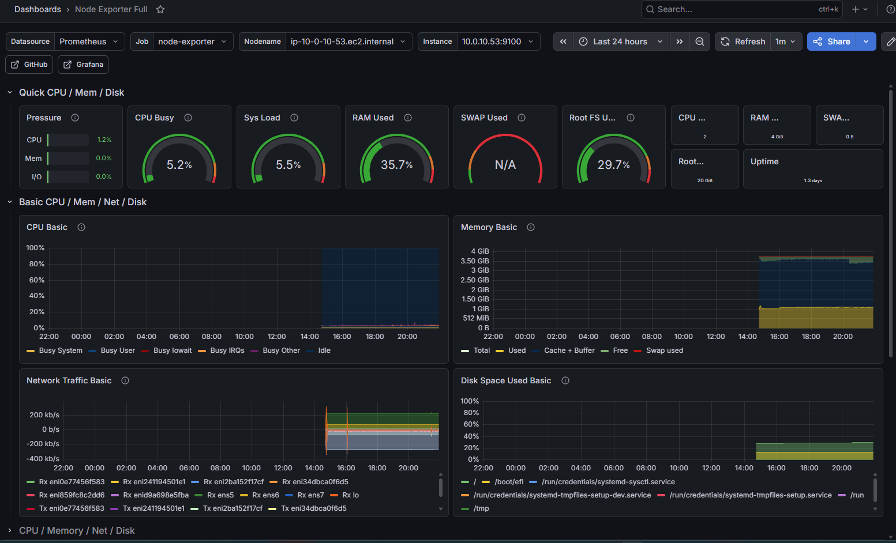

## Kubernetes Cluster Dashboard

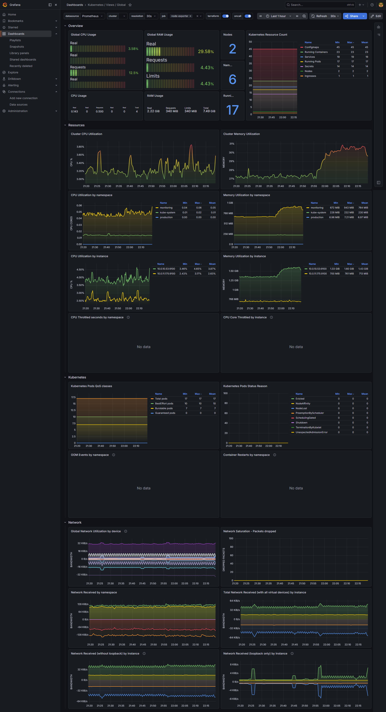

## Kubernetes Nodes Dashboard

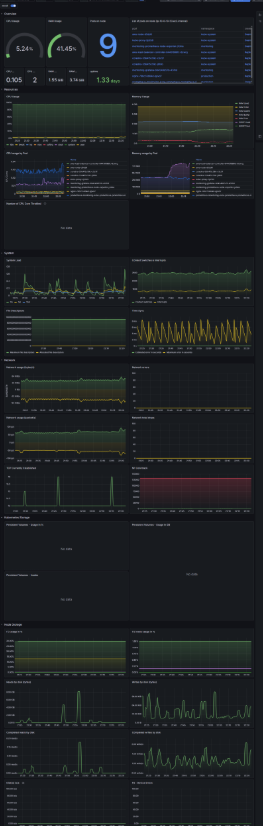

## Kubernetes Pods Dashboard

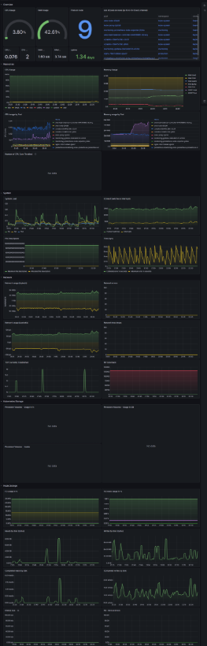

## Prometheus Targets

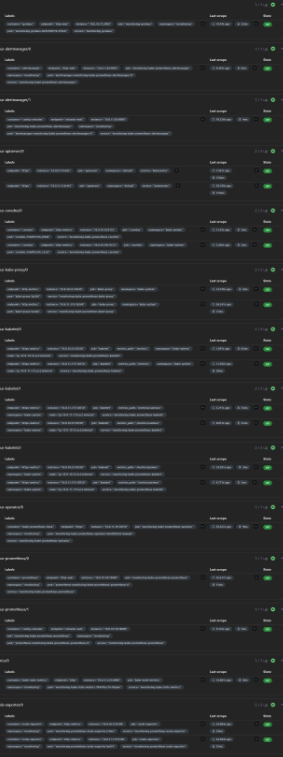

### Dashboards

- Node Exporter Full (1860)
- Kubernetes Views Global (15757)
- Kubernetes Views Nodes (15759)
- Kubernetes Views Pods (15760)

### Metrics Collected

- Node CPU
- Node Memory
- Pod CPU
- Pod Memory
- Filesystem Usage
- Network Traffic
- Deployment Status
- Cluster Health

### Tools Installed

- Prometheus
- Grafana
- Alertmanager
- Node Exporter
- kube-state-metrics
- Prometheus Operator

### Features

- Cluster-level metrics
- Node-level metrics
- Pod-level metrics
- Namespace-level metrics
- Built-in Grafana dashboards
- Prometheus target discovery
- 7-day metric retention

### Namespace

```bash
monitoring
Verification Commands
kubectl get pods -n monitoring
kubectl get svc -n monitoring
kubectl port-forward svc/monitoring-grafana 3000:80 -n monitoring
kubectl port-forward svc/monitoring-kube-prometheus-prometheus 9090:9090 -n monitoring

Grafana runs locally at:

http://localhost:3000

Prometheus runs locally at:

http://localhost:9090

---
## Author

### Babatunde Ayo

DevOps Engineer | AWS Cloud Engineer | Software Developer

- GitHub: [@digimind34](https://github.com/digimind34)
- Portfolio: [DigimindIT](https://digimindit.com)
- LinkedIn: Add your LinkedIn profile URL here
  
---- 
- ## Resume

View my DevOps Resume: [Resume Link Here]
```
